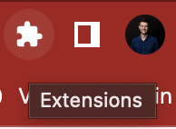
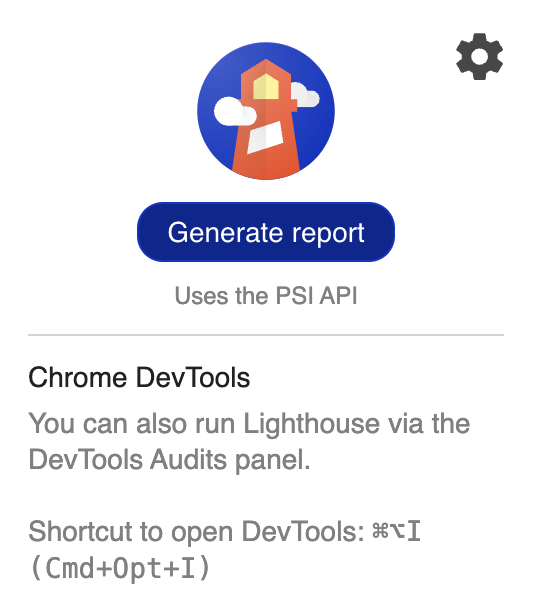
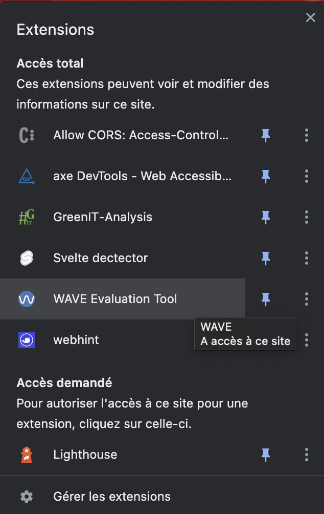
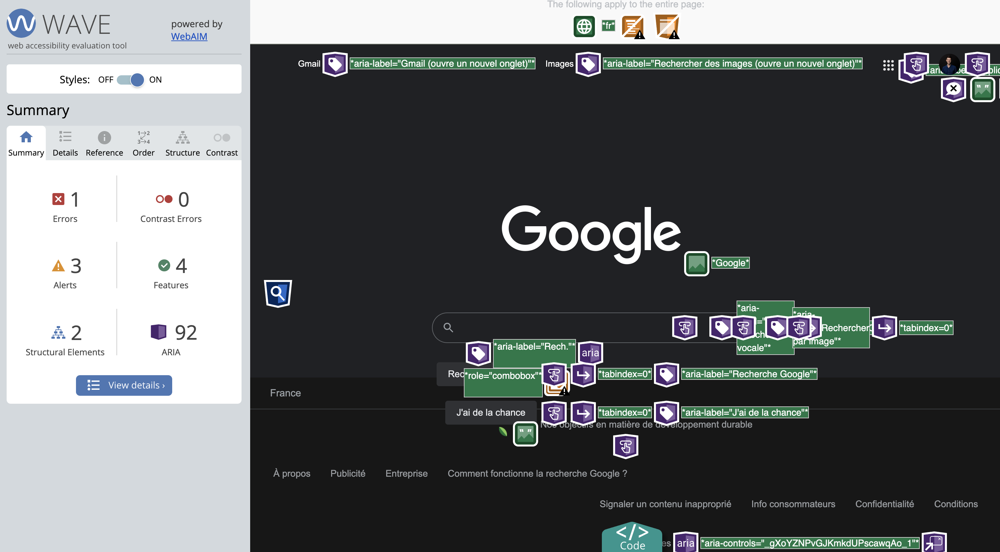
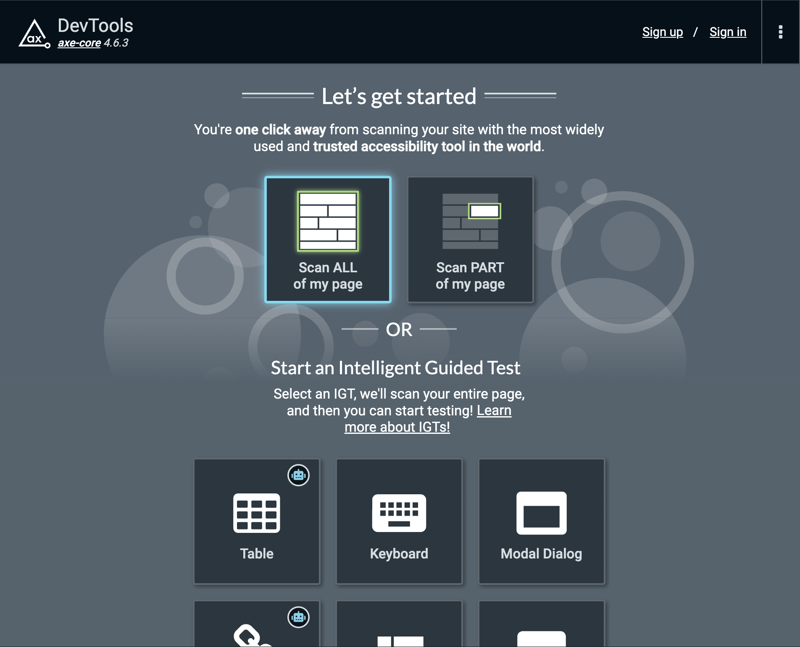

summary: TP accessibilité & eco-conception
id: lab-a11y-greenit
tags: a11y greenit
authors: Alex PALMA & Anthony LE GOAS

# Découvrir l'accessibilité web & l'eco-conception par la pratique
<!-- ------------------------ -->
## Objectifs
Duration: 1

### Vous allez apprendre à :
- Utiliser un lecteur d'écran
- Identifier des problèmes d'accessibilité via des outils d'audit
- Corriger certaines erreurs d'accessibilité
- Identifier des problèmes d'éco-conception via des outils d'audit

## Théorie - accessibilité
Duration: 15

Attendez d'avoir assisté à la partie théorique avant passer à l'étape suivante.

## TP n°1 - Utiliser le lecteur d'écran
Duration: 20min

Ce TP a pour objectif de vous mettre en situation de non-voyant naviguant sur le web et essayant de réaliser des tâches "simples" pour tout autre utilisateur du web.

- Rendez-vous sur le site de la FNAC https://www.fnac.com/
- Activez le lecteur d'écran de votre ordinateur (voir https://dequeuniversity.com/screenreaders/)
- Fermez les yeux et tentez de commander le livre "A11Y Unraveled" uniquement grâce au lecteur d'écran

<!-- ------------------------ -->
## Pré-requis audit d'accessibilité
Duration: 15

### Outils nécessaires pour réaliser les exercices
- Google Chrome
- Lighthouse 
- Wave
- Axe DevTools

Suivez scrupulesement les intructions suivantes pour être sûr de pouvoir réaliser les exercices sans rencontrer de problème.

### Google Chrome

Vous aurez besoin du navigateur web Google Chrome pour réaliser les exercices car c'est au travers d'extensions Google Chrome que vous pourrez utiliser des outils d'audits d'accessibilité.
À noter qu'il existe également des extensions similaires pour les autres navigateurs.

Si vous ne l'avez pas sur votre PC, rendez-vous [ici](https://www.google.com/intl/fr/chrome) pour l'installer.

### Lighthouse

Lighthouse est une extension qui permet de mener différents types d'audits sur un site web, incluant notamment un certain nombre de vérifications relatives à l'accessibilité (mais aussi aux performances, aux bonnes pratiques, au SEO et aux PWA).

Lighthouse est nativement disponible dans Google Chrome. Pour accéder à l'outil, rendez-vous en haut à droite de votre navigateur, sur le menu **Extensions**.

Ensuite, cliquez sur **Lighthouse**.

Une fenêtre s'affiche alors et vous pouvez lancer un audit lighthouse en cliquant sur le bouton **Generate report**.

Les résultats de l'audit s'afficheront dans un nouvel onglet de votre navigateur.

### WAVE Evaluation Tool

WAVE Evaluation Tool est un outil permettant de lancer des audits d'accessibilité dans un navigateur. Il est disponible au travers d'une extension de navigateur.

Vous pouvez ajouter l'extension à Google Chrome à partir du lien suivant : [WAVE Evaluation Tool](https://chrome.google.com/webstore/detail/wave-evaluation-tool/jbbplnpkjmmeebjpijfedlgcdilocofh)

Pour accéder à l'outil, rendez-vous en haut à droite de votre navigateur, sur le menu **Extensions**.

Cliquez ensuite sur **WAVE Evaluation Tool** pour lancer un audit.

Les résultats s'afficheront ensuite directement sur la page web : 

### Axe DevTools

Axe DevTools est un outil permettant de lancer des audits d'accessibilité dans un navigateur. Il est disponible au travers d'une extension de navigateur.

Vous pouvez ajouter l'extension à Google Chrome à partir du lien suivant : [Axe DevTools](https://chrome.google.com/webstore/detail/axe-devtools-web-accessib/lhdoppojpmngadmnindnejefpokejbdd)

Pour y accéder, ouvrez les DevTools du navigateur (appuyez sur **F12**).

Ensuite, dans le menu suivant, accéder à l'onglet **axe DevTools**.

Pour lancer un audit sur la page entière, cliquez sur le bouton `Scan ALL of my page`: 

Les resultats s'affichent ensuite dans les DevTools.

## TP n°2 - Audit a11y FNAC
Duration: 15

- Utilisez les outils d'audit installés précédemment pour auditer le site de la FNAC.
- Vous pouvez mener des audits sur différentes pages du site.
- Identifiez les pistes d'amélioration pour une meilleure accessibilité du site.

## TP n°3 - Audit a11y IMT Atlantique
Duration: 15

- Utilisez les outils d'audit installés précédemment pour auditer le site de l'IMT Atlantique'.
- Vous pouvez mener des audits sur différentes pages du site.
- Identifiez les pistes d'amélioration pour une meilleure accessibilité du site.

## Théorie - éco-conception
Duration: 15

Attendez d'avoir assisté à la partie théorique avant passer à l'étape suivante.

## TP n°4 - Mesurer votre impact carbone lié au numérique
Duration: 10

Rendez-vous sur le site https://impactco2.fr/usagenumerique et :
- mesurez votre impact carbone personnel
- jouez avec les différents indicateurs (mail, streaming, visio) pour comprendre leur impact

## Pré-requis éco-conception
Duration: 5

### Outils nécessaires pour réaliser les exercices
- GreenIT Analysis

### GreenIT Analysis

**GreenIT Analysis** est un outil permettant de lancer des audits d'accessibilité dans un navigateur. Il est disponible au travers d'une extension de navigateur.

Vous pouvez ajouter l'extension à Google Chrome à partir du lien suivant : [GreenIT Analysis](https://chrome.google.com/webstore/detail/greenit-analysis/mofbfhffeklkbebfclfaiifefjflcpad?hl=fr)

Pour y accéder, ouvrez les DevTools du navigateur (appuyez sur **F12**).

Ensuite, dans le menu suivant, accéder à l'onglet **axe DevTools**.

Pour lancer un audit sur la page entière, cliquez sur le bouton **Lancer l'analyse**, et cochez la case **Activer l'analyse des bonnes pratiques**: 

Les resultats s'affichent ensuite dans les DevTools.

## TP n°5 - Audit d'éco-conception
Duration: 20

Testez l'extension GreenIT Analysis sur différents site web et analysez les résultats.

Exemples de site web à analyser :
- IMT Atlantique
- FNAC
- Ali Express
- Decathlon
- ...

Prenez le temps de lire chacune des bonnes pratiques d'éco-conception en cliquant sur chacune d'entre elles.

