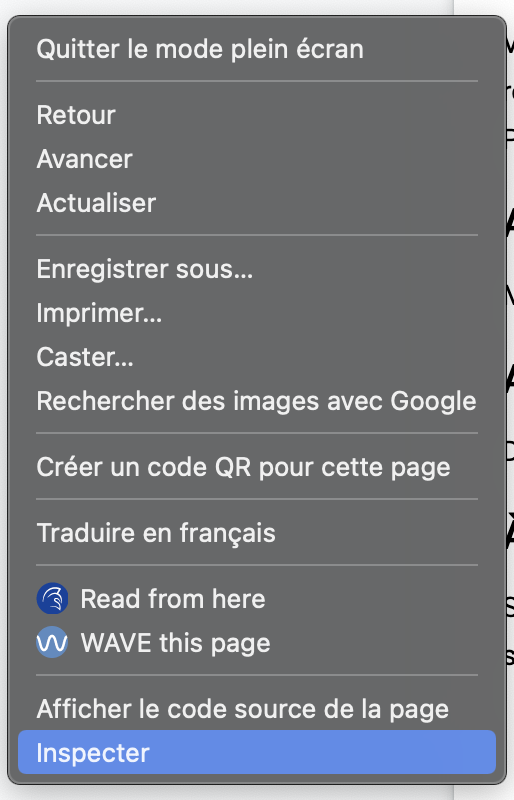
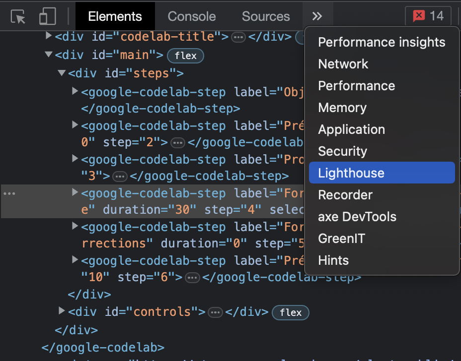

summary: TP accessibilité & eco-conception
id: lab-a11y-greenit
tags: a11y greenit
authors: Alex PALMA & Anthony LE GOAS

# Découvrir l'accessibilité web & l'eco-conception par la pratique
<!-- ------------------------ -->
## Objectifs
Duration: 1

### Vous allez apprendre à :
- Utiliser un lecteur d'écran
- Identifier des problèmes d'accessibilité via des outils d'audit
- Corriger certaines erreurs d'accessibilité
- Identifier des problèmes d'éco-conception via des outils d'audit
- Corriger certaines erreurs d'eco-conception

<!-- ------------------------ -->
## Pré-requis accessibilité
Duration: 10

### Outils nécessaires pour réaliser les exercices
- Google Chrome
- VSCode
- VSCode Live Server
- Lighthouse 
- Wave
- Axe DevTools

Pour découvrir l'accessibilité par la pratique, nous vous proposons

Suivez scrupulesement les intructions suivantes pour être sûr de pouvoir réaliser les exercices sans rencontrer de problème.

### Google Chrome

Vous aurez besoin du navigateur web Google Chrome pour réaliser les exercices car c'est au travers d'extensions Google Chrome que vous pourrez tester un lecteur d'écran et que vous pourrez mener des audits d'accessibilité.
Si vous ne l'avez pas sur votre PC, rendez-vous [ici](https://www.google.com/intl/fr/chrome) pour l'installer.

### VS Code

Une fois les problèmes d'accessibilité identifiés, vous aurez à les corriger en modifiant le code du projet dans VS Code.
Vous pouvez télécharger VS Code [ici](https://code.visualstudio.com/download).

### VS Code Live Server

Pour pouvoir lancer le projet qui servira d'exemple et mener des audits d'accessibilité, il est nécessaire d'installer l'extension VS Code Live Server.
Pour ce faire, commencez par lancer VS Code. Ensuite, dans le menu de gauche de VS Code, sélectionnez l'onglet **Extensions**.

Dans la barre de recherche, saisissez **Liver Server** et installez la première extension proposée.

### Lighthouse

Lighthouse est une extension qui permet de mener différents types d'audits sur un site web, incluant notamment un certain nombres de vérifications relatives à l'accessibilité (mais aussi aux performances, au SEO, etc).

Lighthouse est nativement disponible dans Google Chrome. Pour y accéder, faites un **clic droit** sur une page internet et sélectionnez **inspecter** dans le menu qui s'affiche.

Ensuite, accéder à l'onglet **Lighthouse**

Depuis cet onglet, vous pouvez maintenant lancer des audits Lighthouse.

### Wave

todo
https://wave.webaim.org/extension/

### Axe DevTools

todo

## Projet exemple

Vous allez utiliser un projet exemple pour découvrir l'accessibilité, mener des audits et appliquer des corrections suite aux retours d'audit.
Ce projet est à télécharger sur le lien suivant : 

Une fois le .zip récupéré, dézippez le dans le répertoire de votre choix sur votre PC.

Lancez le projet... todo

<!-- ------------------------ -->
## Connexion : à l'aveugle
Duration: 30

Vous allez à présent vous mettre à la place d'une personne non-voyante utilisant un site internet.
Vous allez avoir à remplir un formulaire du connexion (utilisateur + mot de passe) et tenter de vous connecter via le bouton **Se connecter**. Puisque vous ne verez pas l'écran, vous serez guidé par le lecteur d'écran.

### Activez le lecteur d'écran

Mettez vos écouteurs ou votre casque pour ne pas gêner vos voisins.
Activer l'extension ... todo

### Accédez à la page de connexion

Dans votre navigateur accéder à la page de connexion du projet.

### À l'aveugle

Saisissez le masque qui vous a été donné, portez-le et essayez de vous connecter.
Les identifiants de connexion sont les suivants :
- Utilisateur : to do
- Mot de passe : to do

C'est parti !

## Connexion : audits & corrections

to do 
## Pré-requis éco-conception
Duration: 10

### Outils nécessaires pour réaliser les exercices
- Google Chrome
- GreenIT Analysis

### Google Chrome

Vous aurez besoin du navigateur web Google Chrome pour réaliser les exercices. C'est au travers d'extensions Google Chrome que vous pourrez tester un  mener des audits d'éco-conception.
Si vous ne l'avez pas sur votre PC, rendez-vous [ici](https://www.google.com/intl/fr/chrome) pour l'installer.

### GreenIT Analysis

to do 