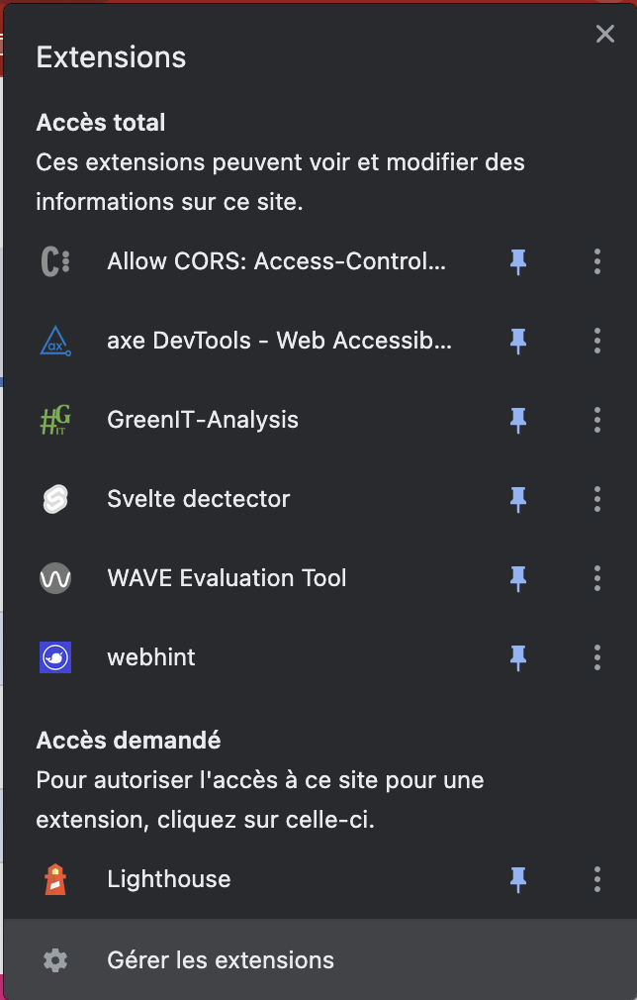

summary: TP accessibilité & eco-conception
id: lab-a11y-greenit
tags: a11y greenit
authors: Alex PALMA & Anthony LE GOAS

# Découvrir l'accessibilité web & l'eco-conception par la pratique
<!-- ------------------------ -->
## Objectifs
Duration: 1

### Vous allez apprendre à :
- Utiliser un lecteur d'écran
- Identifier des problèmes d'accessibilité via des outils d'audit
- Corriger certaines erreurs d'accessibilité
- Identifier des problèmes d'éco-conception via des outils d'audit

<!-- ------------------------ -->
## Pré-requis accessibilité
Duration: 15

### Outils nécessaires pour réaliser les exercices
- Google Chrome
- VSCode
- VSCode Live Server
- Lighthouse 
- Wave
- Axe DevTools

Suivez scrupulesement les intructions suivantes pour être sûr de pouvoir réaliser les exercices sans rencontrer de problème.

### Google Chrome

Vous aurez besoin du navigateur web Google Chrome pour réaliser les exercices car c'est au travers d'extensions Google Chrome que vous pourrez tester un lecteur d'écran et que vous pourrez mener des audits d'accessibilité.
Si vous ne l'avez pas sur votre PC, rendez-vous [ici](https://www.google.com/intl/fr/chrome) pour l'installer.

### VS Code

Une fois les problèmes d'accessibilité identifiés, vous aurez à les corriger en modifiant le code du projet dans VS Code.
Vous pouvez télécharger VS Code [ici](https://code.visualstudio.com/download).

### VS Code Live Server

Pour pouvoir lancer le projet qui servira d'exemple et mener des audits d'accessibilité, il est nécessaire d'installer l'extension VS Code Live Server.
Pour ce faire, commencez par lancer VS Code. Ensuite, dans le menu de gauche de VS Code, sélectionnez l'onglet **Extensions**.

Dans la barre de recherche, saisissez **Live Server** et installez la première extension proposée.

### Lighthouse

Lighthouse est une extension qui permet de mener différents types d'audits sur un site web, incluant notamment un certain nombre de vérifications relatives à l'accessibilité (mais aussi aux performances, aux bonnes pratiques, au SEO et aux PWA).

Lighthouse est nativement disponible dans Google Chrome. Pour accéder à l'outil, rendez-vous en haut à droite de votre navigateur, sur le menu **Extensions**.

Ensuite, cliquez sur **Lighthouse**.

Une fenêtre s'affiche alors et vous pouvez lancer un audit lighthouse en cliquant sur le bouton **Generate report**.

Les résultats de l'audit s'afficheront dans un nouvel onglet de votre navigateur.

### WAVE Evaluation Tool

WAVE Evaluation Tool est un outil permettant de lancer des audits d'accessibilité dans un navigateur. Il est disponible au travers d'une extension de navigateur.

Vous pouvez ajouter l'extension à Google Chrome à partir du lien suivant : [WAVE Evaluation Tool](https://chrome.google.com/webstore/detail/wave-evaluation-tool/jbbplnpkjmmeebjpijfedlgcdilocofh)

Pour accéder à l'outil, rendez-vous en haut à droite de votre navigateur, sur le menu **Extensions**.

Cliquez ensuite sur **WAVE Evaluation Tool** pour lancer un audit.

Les résultats s'afficheront ensuite directement sur la page web : 

### Axe DevTools

Axe DevTools est un outil permettant de lancer des audits d'accessibilité dans un navigateur. Il est disponible au travers d'une extension de navigateur.

Vous pouvez ajouter l'extension à Google Chrome à partir du lien suivant : [Axe DevTools](https://chrome.google.com/webstore/detail/axe-devtools-web-accessib/lhdoppojpmngadmnindnejefpokejbdd)

Pour y accéder, ouvrez les DevTools du navigateur (appuyez sur **F12**).

Ensuite, dans le menu suivant, accéder à l'onglet **axe DevTools**.

Pour lancer un audit sur la page entière, cliquez sur le bouton `Scan ALL of my page`: 

Les resultats s'affichent ensuite dans les DevTools.

### Screen Reader

L'extension de navigateur **Screen Reader** est un lecteur d'écran pour navigateur. Un lecteur d'écran est un logiciel d’assistance technique destiné aux personnes « empêchées de lire » (aveugles, fortement malvoyantes, dyslexiques, dyspraxiques…) : il retranscrit par synthèse vocale et/ou sur un afficheur braille ce qui est affiché sur l'écran d'un ordinateur tant en termes de contenu que de structure.

Vous pouvez ajouter l'extension à Google Chrome à partir du lien suivant : [Screen Reader](https://chrome.google.com/webstore/detail/screen-reader/kgejglhpjiefppelpmljglcjbhoiplfn?hl=fr)

Pour l'activer, il vous faudra ensuite passer par le menu **Extensions** puis **Gérer les extensions** de Google Chrome.

Attention ! Dès lors que vous activez l'extension, toute action que vous ferez dans votre navigateur risque d'entrainer la prise de parole du lecteur d'écran, donc mettez vos écouteurs.

.

.

## Projet exemple
Duration: 5

Vous allez utiliser un projet exemple pour découvrir l'accessibilité par la pratique, en menant des audits avec les outils installés précédement et vous pourrez appliquer des corrections suite aux retours des audits.

### Télécharger le projet

Le projet exemple est à télécharger sur le lien suivant : [https://wetransfer.com/downloads/2d18dd1ea849d22698521307fcec085720230321003757/f39bf2](https://wetransfer.com/downloads/2d18dd1ea849d22698521307fcec085720230321003757/f39bf2)

Récupérez le .zip puis dézippez le dans le répertoire de votre choix sur votre PC.

### Lancer le projet en local

Pour lancer le projet en local, sur votre PC, réalisez les opérations suivantes :
- ouvrez le projet dans VS Code
- dans les sources du projet, faites un **clic droit** sur le fichier **index.html** et choisissez **Open with Five Server**.
- un nouvel onglet Chrome devrait s'ouvrir sur l'adresse suivante : **http://127.0.0.1:5555/index.html**

<!-- ------------------------ -->
## Connexion : à l'aveugle
Duration: 15

Vous allez à présent vous mettre à la place d'une personne non-voyante utilisant un site internet.
Vous allez avoir à remplir le formulaire du connexion du projet exemple (utilisateur + mot de passe) et vous tenterez de vous connecter. Puisque vous ne verez pas l'écran, vous serez guidé par le lecteur d'écran.

### Activez le lecteur d'écran

Mettez vos écouteurs ou votre casque pour ne pas gêner vos voisins.

Activer l'extension **Screen Reader**.

### Accédez à la page de connexion

Dans votre navigateur accéder à la page de connexion du projet.

### À l'aveugle

Saisissez le masque qui vous a été donné, portez-le et essayez de vous connecter.
Etant ôté de la vue, vous serez contraints d'utiliser uniquement les touches du clavier : **tabulation**, **entrée**, ...

Les identifiants de connexion sont les suivants :
- Utilisateur : `Specimen29`
- Mot de passe : `SuPer@ccEssIblE!`

C'est parti !

Désactivez le lecteur d'écran quand vous avez réussi.

## Connexion : audits & corrections
Duration: 30

Vous l'aurez-vu avec le lecteur d'écran, le formulaire de connexion n'est pas accessible du tout, impossible de se connecter en utilisant seulement son clavier.

Vous allez maintenant rendre cette page beaucoup plus accessible à tous.
Pour ce faire, lancez les outils d'audit d'accessibilité installés précédemment, identifiez les problèmes et corrigez les directement en modifiant le code de la page.

Répétez l'opération jusqu'à ce que les 3 outils d'audit ne remontent plus aucune erreur.
N'hésitez pas à regarder sur internet comment corriger les erreurs ou à solliciter les intervenants.

Une fois les corrections apportées vous pouvez réactiver le lecteur d'écran. L'expérience de navigation au clavier devrait être plus agréable et vous devriez réussir à vous connecter.

## Blog : à l'aveugle
Duration: 15

Vous allez à présent vous mettre à la place d'une personne non-voyante naviguant sur un blog.

### Activez le lecteur d'écran

Mettez vos écouteurs ou votre casque pour ne pas gêner vos voisins.

Activer l'extension ***Screen Reader**.

### Accédez à la page de blog

Dans votre navigateur accéder à la page de blog `http://127.0.0.1:5555/very-bad-blog.html`.

### À l'aveugle

Saisissez le masque qui vous a été donné, portez-le et tentez d'accéder à l'article **L'accessibilité, pour les nuls** (vous devez actionner le bouton **Lire la suite** de cet article).
Etant ôté de la vue, vous serez contraints d'utiliser uniquement les touches du clavier : **tabulation**, **entrée**, ...

C'est parti !

Désactivez le lecteur d'écran quand vous avez réussi.

## Blog : audits & corrections
Duration: 30

Vous allez maintenant rendre cette page beaucoup plus accessible à tous.
Pour ce faire, lancez les outils d'audit d'accessibilité installés précédemment, identifiez les problèmes et corrigez les directement en modifiant le code de la page.

Répétez l'opération jusqu'à ce que les 3 outils d'audit ne remontent plus aucune erreur.
N'hésitez pas à regarder sur internet comment corriger les erreurs ou à solliciter les intervenants.

Une fois les corrections apportées vous pouvez réactiver le lecteur d'écran. L'expérience de navigation au clavier devrait être plus agréable et il sera plus aisé d'accéder à l'article **L'accessibilité, pour les nuls**.

## Pré-requis éco-conception
Duration: 5

### Outils nécessaires pour réaliser les exercices
- GreenIT Analysis

### GreenIT Analysis

**GreenIT Analysis** est un outil permettant de lancer des audits d'accessibilité dans un navigateur. Il est disponible au travers d'une extension de navigateur.

Vous pouvez ajouter l'extension à Google Chrome à partir du lien suivant : [GreenIT Analysis](https://chrome.google.com/webstore/detail/greenit-analysis/mofbfhffeklkbebfclfaiifefjflcpad?hl=fr)

Pour y accéder, ouvrez les DevTools du navigateur (appuyez sur **F12**).

Ensuite, dans le menu suivant, accéder à l'onglet **axe DevTools**.

Pour lancer un audit sur la page entière, cliquez sur le bouton **Lancer l'analyse**, et cochez la case **Activer l'analyse des bonnes pratiques**: 

Les resultats s'affichent ensuite dans les DevTools.

## Audit d'éco-conception
Duration: 20

Testez l'extension GreenIT Analysis sur différents site web et analysez les résultats.

Exemples de site web à analyser :
- Le projet exemple
- Le site des instructions du TP
- IMT Atlantique
- Ali Express
- Decathlon
- ...

Prenez le temps de lire chacune des bonnes pratiques d'éco-conception en cliquant sur chacune d'entre elles.

